# PALAPA BUDAYA GO - Technical Diagrams & Architecture

> **AI-Powered Cultural Tourism Platform for Indonesia**
> Comprehensive Mermaid diagrams for technical proposal and system documentation

## Table of Contents

- [PALAPA BUDAYA GO - Technical Diagrams \& Architecture](#palapa-budaya-go---technical-diagrams--architecture)
  - [Table of Contents](#table-of-contents)
  - [User Flow Diagram](#user-flow-diagram)
  - [System Architecture](#system-architecture)
  - [Data Flow Diagram](#data-flow-diagram)
  - [Entity Relationship Diagram](#entity-relationship-diagram)
  - [Project Timeline (Gantt Chart)](#project-timeline-gantt-chart)
  - [API Sequence Diagram](#api-sequence-diagram)
  - [Feature Mind Map](#feature-mind-map)
  - [Technology Stack Flow](#technology-stack-flow)
  - [Architecture Decision Records](#architecture-decision-records)
    - [ADR 1: AI-First Architecture](#adr-1-ai-first-architecture)
    - [ADR 2: Local Parlant Implementation](#adr-2-local-parlant-implementation)
    - [ADR 3: Firebase Ecosystem](#adr-3-firebase-ecosystem)
  - [Performance Metrics](#performance-metrics)
  - [Deployment Architecture](#deployment-architecture)

---

## User Flow Diagram

```mermaid
flowchart TD
    A[👤 Tourist Visits Website] --> B{First Time User?}
    B -->|Yes| C[📝 Register Account]
    B -->|No| D[🔐 Login]

    C --> E[🎯 Select Destination: Yogyakarta]
    D --> E

    E --> F[🤖 AI Chatbot: "Mau liburan seperti apa?"]
    F --> G[👤 User Input: "3 hari fokus budaya & kuliner"]

    G --> H[🧠 AI Journey Planning]
    H --> I[📋 Generate Itinerary:
         - Day 1: Keraton & Malioboro
         - Day 2: Borobudur & Prambanan
         - Day 3: UMKM Shopping]

    I --> J[🛍️ AI UMKM Recommendations]
    J --> K[💰 Booking & Payment]

    K --> L[🗺️ Route Optimization]
    L --> M[🌤️ Weather Check]

    M --> N[📱 Receive Confirmation]
    N --> O[🏰 Experience Cultural Sites]

    O --> P[⭐ Rate & Review]
    P --> Q[🔄 Plan Next Trip]

    style A fill:#e1f5fe
    style F fill:#f3e5f5
    style H fill:#e8f5e8
    style J fill:#fff3e0
    style O fill:#fce4ec
```

---

## System Architecture


---

## Data Flow Diagram

```mermaid
sequenceDiagram
    participant U as 👤 User
    participant FE as 🎨 Frontend
    participant AI as 🧠 Gemini AI
    participant DB as 🗄️ Firestore
    participant FS as 🔍 FAISS
    participant EXT as 🔌 External APIs

    U->>FE: Submit itinerary request
    FE->>AI: Generate personalized plan

    AI->>DB: Query destinations data
    DB-->>AI: Return cultural sites

    AI->>FS: Semantic search for recommendations
    FS-->>AI: Vector similarity results

    AI->>EXT: Weather & routing data
    EXT-->>AI: Real-time information

    AI-->>FE: Personalized itinerary + UMKM + weather
    FE-->>U: Display complete travel plan

    U->>FE: Book experience
    FE->>DB: Create booking record
    DB-->>FE: Confirmation

    Note over U,EXT: Real-time data integration with AI personalization
```



---

## Entity Relationship Diagram

```mermaid
erDiagram
    USER ||--o{ BOOKING : makes
    USER ||--o{ REVIEW : writes
    USER ||--o{ ITINERARY : creates
    USER ||--o{ MESSAGE : sends

    ITINERARY ||--o{ ITINERARY_DESTINATION : contains
    DESTINATION ||--o{ ITINERARY_DESTINATION : "part of"
    DESTINATION ||--o{ REVIEW : receives
    DESTINATION ||--o{ BOOKING : books

    UMKM ||--o{ REVIEW : receives
    BOOKING ||--o{ PAYMENT : requires

    AI_MODEL ||--o{ ITINERARY : generates
    AI_MODEL ||--o{ CONVERSATION : processes
    CONVERSATION ||--o{ MESSAGE : contains

    DESTINATION_EMBEDDING }o--|| DESTINATION : belongs_to
    UMKM_EMBEDDING }o--|| UMKM : belongs_to

    WEATHER_CACHE ||--o{ DESTINATION : provides
    ROUTE_CACHE ||--o{ DESTINATION : optimizes

    USER {
        id PK
        email
        name
        preferences
        created_at
    }

    DESTINATION {
        id PK
        name
        category
        description
        coordinates
        province
        created_at
    }

    UMKM {
        id PK
        name
        category
        address
        description
        rating
        contact
    }

    BOOKING {
        id PK
        user_id FK
        destination_id FK
        booking_date
        total_price
        status
    }

    ITINERARY {
        id PK
        user_id FK
        title
        days
        created_at
    }

    AI_MODEL {
        id PK
        name
        version
        purpose
        parameters
    }
```

---

## Project Timeline (Gantt Chart)


---

## API Sequence Diagram

```mermaid
sequenceDiagram
    participant C as 👤 Client App
    participant GW as 🚪 API Gateway
    participant AI as 🧠 Gemini AI
    participant DB as 🗄️ Firestore
    participant FS as 🔍 FAISS
    participant WX as 🌤️ Weather API
    participant RT as 🗺️ OSRM Routing

    C->>GW: POST /api/itinerary/generate
    GW->>AI: Generate itinerary with Parlant Journey

    AI->>DB: Query user preferences
    DB-->>AI: User profile data

    AI->>FS: Semantic search destinations
    FS-->>AI: Ranked destination results

    AI->>WX: Get weather forecast
    WX-->>AI: Weather data for itinerary

    AI->>RT: Calculate optimal routes
    RT-->>AI: Route optimization data

    AI->>DB: Store generated itinerary
    DB-->>AI: Confirmation

    AI-->>GW: Personalized itinerary response
    GW-->>C: Complete travel plan

    Note over C,RT: Full AI-powered personalization with real-time data
```



---

## Feature Mind Map

```mermaid
flowchart TD
    A[🎯 PALAPA BUDAYA GO] --> B[🤖 AI-Powered Features]
    A --> C[🎨 User Experience]
    A --> D[🏛️ Cultural Content]
    A --> E[⚡ Technical Excellence]

    B --> F[🧠 Gemini AI Engine]
    F --> F1[Itinerary Generation]
    F --> F2[Cultural Recommendations]
    F --> F3[Personalized Chat]

    B --> G[🗣️ Parlant Conversational AI]
    G --> G1[Journey Definitions]
    G --> G2[Cultural Guidelines]
    G --> G3[Dynamic Responses]

    B --> H[🔍 FAISS Semantic Search]
    H --> H1[Destination Retrieval]
    H --> H2[UMKM Recommendations]
    H --> H3[Cultural Content Search]

    C --> I[🌐 Web Platform]
    I --> I1[Responsive Design]
    I --> I2[Intuitive Navigation]
    I --> I3[Mobile-First Approach]

    C --> J[💬 AI Chatbot]
    J --> J1[Natural Language]
    J --> J2[Cultural Context]
    J --> J3[24/7 Support]

    C --> K[🗺️ Interactive Maps]
    K --> K1[Route Optimization]
    K --> K2[Location Services]
    K --> K3[Offline Capability]

    D --> L[🏰 Destination Database]
    L --> L1[1400+ Sites]
    L --> L2[Cultural Information]
    L --> L3[Visitor Reviews]

    D --> M[🛍️ UMKM Marketplace]
    M --> M1[Local Artisans]
    M --> M2[Traditional Products]
    M --> M3[Economic Support]

    D --> N[📚 Cultural Education]
    N --> N1[Historical Context]
    N --> N2[Etiquette Guidelines]
    N --> N3[Language Learning]

    E --> O[🔄 Real-time APIs]
    O --> O1[Weather Integration]
    O --> O2[Route Optimization]
    O --> O3[Payment Processing]

    E --> P[🔒 Security & Privacy]
    P --> P1[Firebase Auth]
    P --> P2[Data Encryption]
    P --> P3[GDPR Compliance]

    E --> Q[📊 Analytics & Insights]
    Q --> Q1[User Behavior]
    Q --> Q2[Performance Metrics]
    Q --> Q3[Cultural Impact]

    style A fill:#e1f5fe,stroke:#01579b,stroke-width:3px
    style B fill:#f3e5f5,stroke:#4a148c,stroke-width:2px
    style C fill:#e8f5e8,stroke:#1b5e20,stroke-width:2px
    style D fill:#fff3e0,stroke:#e65100,stroke-width:2px
    style E fill:#fce4ec,stroke:#880e4f,stroke-width:2px
```



---

## Technology Stack Flow

```mermaid
flowchart LR
    subgraph "🎨 Frontend"
        A[Next.js 14]
        B[React 18]
        C[Tailwind CSS]
        D[TypeScript]
        E[Leaflet Maps]
    end

    subgraph "🧠 AI & ML"
        F[Google Gemini AI]
        G[Parlant SDK]
        H[FAISS Vector DB]
        I[Perplexity API]
    end

    subgraph "⚙️ Backend"
        J[Next.js API]
        K[Firebase Admin]
        L[Node.js Runtime]
        M[Express-like Routes]
    end

    subgraph "🗄️ Database"
        N[Firestore]
        O[Firebase Storage]
        P[FAISS Index]
    end

    subgraph "🔌 Integrations"
        Q[OpenWeatherMap]
        R[OSRM Routing]
        S[Payment Gateway]
        T[Firebase Auth]
    end

    A --> J
    B --> A
    C --> A
    D --> A
    E --> A

    F --> J
    G --> F
    H --> F
    I --> F

    J --> N
    J --> O
    J --> P
    K --> J
    L --> J
    M --> J

    Q --> J
    R --> J
    S --> J
    T --> J

    style A fill:#e3f2fd,stroke:#01579b,stroke-width:2px
    style F fill:#f3e5f5,stroke:#4a148c,stroke-width:2px
    style J fill:#e8f5e8,stroke:#1b5e20,stroke-width:2px
    style N fill:#fff3e0,stroke:#e65100,stroke-width:2px
    style Q fill:#fce4ec,stroke:#880e4f,stroke-width:2px
```



---

## Architecture Decision Records

### ADR 1: AI-First Architecture
**Decision:** Implement AI as the core of all user interactions rather than traditional CRUD operations.

**Rationale:**
- AI enables personalized, conversational experiences
- Reduces development complexity for complex cultural recommendations
- Future-proofs the platform for advanced features

### ADR 2: Local Parlant Implementation
**Decision:** Use local Parlant components instead of external server dependency.

**Rationale:**
- Reduces infrastructure complexity and costs
- Enables offline/local development
- Maintains full control over conversational logic
- Easier deployment and scaling

### ADR 3: Firebase Ecosystem
**Decision:** Use Firebase for all backend services (Auth, Database, Storage, Hosting).

**Rationale:**
- Rapid development and deployment
- Built-in scalability and security
- Cost-effective for startup phase
- Excellent integration with web/mobile apps

---

## Performance Metrics


---

## Deployment Architecture


---

*Generated for PALAPA BUDAYA GO Technical Proposal - November 2024*
